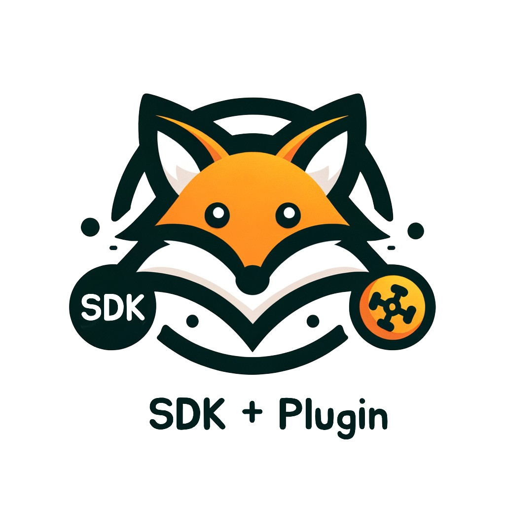

# vfox GUI

[](https://github.com/vfox-dev/vfox)
[](https://fyne.io)
[](https://github.com/vfox-dev/vfox-gui/actions/workflows/build.yml)

> A cross-platform desktop GUI for [vfox](https://github.com/vfox-dev/vfox), the modern SDK version manager.



vfox GUI provides a clean, intuitive desktop interface to manage SDKs (e.g., Node.js, Go, Python, Rust, Java) without touching the command line. It wraps the `vfox` CLI and adds tab-based navigation, real-time output, and seamless version switching across global/project/session scopes.

## ✨ Features

- **Install & Uninstall**: Search, install, and uninstall SDK versions with one click.
- **Version Switching**: Set SDK versions globally, per-project, or for current session.
- **Plugin Management**: Add, update, and remove plugins (e.g. `nodejs`, `golang`, `python`).
- **Info & Inspection**: View SDK details, installed versions, available versions, and current status.
- **Exec Mode**: Run arbitrary commands in an SDK-specific environment.
- **Config & Upgrade**: Manage vfox settings and upgrade vfox itself.

## 🚀 Installation

### Prebuilt Binary (Recommended)

Download the latest `vfox-gui.exe` from the [Releases page](https://github.com/vfox-dev/vfox-gui/releases), then run it directly. No installation required.

> 💡 **Prerequisite**: You must have [`vfox`](https://github.com/vfox-dev/vfox) already installed and available in your `PATH`. If not, install it first:
> ```sh
> # Windows (PowerShell)
> winget install vfox-dev.vfox
> # or via Scoop
> scoop install vfox
> ```

### From Source

1. Ensure you have:
   - Go ≥ 1.22
   - GCC (for CGO; e.g., [WinLibs](https://winlibs.com/))
2. Clone and build:
   ```powershell
   git clone https://github.com/vfox-dev/vfox-gui.git
   cd vfox-gui
   go build -ldflags="-H windowsgui" -o vfox-gui.exe .
   ```
3. Run `vfox-gui.exe`.

## 🛠️ Building (Advanced)

The project uses `fyne bundle` to embed assets (e.g., `logo.png`). To rebuild the bundled resource:

```powershell
fyne bundle logo.png
```

Then re-run `go build` as above.

## 📄 License

MIT

---

# vfox GUI（中文）

[](https://github.com/vfox-dev/vfox)
[](https://fyne.io)
[](https://github.com/vfox-dev/vfox-gui/actions/workflows/build.yml)

> [vfox](https://github.com/vfox-dev/vfox)（现代化 SDK 版本管理器）的跨平台桌面图形界面客户端。


vfox GUI 提供简洁直观的桌面界面，无需命令行即可管理各类 SDK（如 Node.js、Go、Python、Rust、Java）。它封装了 `vfox` CLI，支持标签页导航、实时输出和全局/项目/会话级版本切换。

## ✨ 核心功能

- **安装与卸载**：一键搜索、安装、卸载任意 SDK 版本。
- **版本切换**：自由设置 SDK 版本作用域（全局 / 当前项目 / 当前终端会话）。
- **插件管理**：添加、更新、移除插件（例如 `nodejs`、`golang`、`python`）。
- **信息查看**：查看 SDK 详情、已安装/可安装版本列表、当前使用状态等。
- **执行模式**：在指定 SDK 环境下运行任意命令。
- **配置与升级**：管理 vfox 配置项，并一键升级 vfox 自身。

## 🚀 安装方式

### 预编译二进制（推荐）

从 [发布页面](https://github.com/vfox-dev/vfox-gui/releases) 下载最新版 `vfox-gui.exe`，双击运行即可，无需额外安装。

> 💡 **前置依赖**：你的系统必须已安装 [`vfox`](https://github.com/vfox-dev/vfox) 并加入 `PATH`。若未安装，请先执行：
> ```powershell
> # Windows（PowerShell）
> winget install vfox-dev.vfox
> # 或通过 Scoop
> scoop install vfox
> ```

### 源码构建

1. 确保已安装：
   - Go ≥ 1.22
   - GCC（用于 CGO，例如 [WinLibs](https://winlibs.com/)）
2. 克隆并构建：
   ```powershell
   git clone https://github.com/vfox-dev/vfox-gui.git
   cd vfox-gui
   go build -ldflags="-H windowsgui" -o vfox-gui.exe .
   ```
3. 运行 `vfox-gui.exe`。

## 🛠️ 构建说明（高级）

项目使用 `fyne bundle` 将资源（如 `logo.png`）嵌入二进制。如需重新生成资源文件：

```powershell
fyne bundle logo.png
```

然后按上述步骤重新构建。

## 📄 许可证

MIT